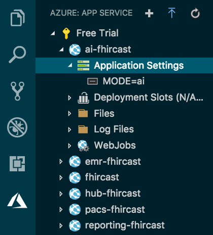

# FHIRcast JavaScript Sandbox
- [Introduction](#introduction)
- [Usage](#usage)
  - [Try it online](#Try-it-online)       
    1. [Select the hub.](#Try-it-online)
    2. [Subscribe to an event.](#Try-it-online)
    3. [Publish an event.](#Try-it-online)
    4. [Monitor the endpoints.](Try-it-online)   
  - [Retrieve context from the hub](#retrieve-context-from-the-hub)
  - [Test the proposed WebSocket channel](#Test-the-websocket-channel-proposed-addition)
  - [Do a SMART on FHIR launch](#SMART-on-FHIR-launch)
    - [Try HTML5 Web Messaging](#HTML5-Web-Messaging)
  - [Simulate workflows](#Simulate-workflows)
  - [Troubleshoot](#troubleshooting)
- [Installation](#installation)
  - [Environment variables](#environment-variables)
  - [Windows and MacOS](#windows-and-macos)
  - [Linux](#linux)
    - [Ubuntu](#ubuntu)
  - [Clouds](#clouds)
    - [Microsoft](#azure)
    - [Google](#google)
    - [Amazon](#amazon)
  - [Mobile (iOS, Android)](#mobile-ios-android)
- [Program Description](#program-description)
  - [Endpoints description](#endpoints-description)
    - [Server (hub) endpoints](#server-hub-endpoints)
    - [Client endpoints](#client-endpoints)
    - [Utility endpoints (not in the standard)](#utility-endpoints-not-in-the-standard)
    - [SMART handling](#smart-handling)
  - [Front-end description](#front-end-description)
    - [HTML](#html)
    - [JavaScript](#javascript)
- [Contribution](#contribution)

# Introduction
FHIRcast® is an HL7 specification designed to provide a lightweight, inexpensive and http-based application context synchronization standard. Find out more at [fhircast.org](http://fhircast.org).

FHIRcast sandboxes provide tools to simulate the workflow of the FHIRcast standard.  They also prototype proposals from the Imaging Integration WorkGruop to provide early feedback on implementability.

This sandbox (sandbox.js) partially implements the standard using JavaScript and Node.js. If you are a C#/.net developer, you might prefer to use the other [FHIRcast sandbox](https://github.com/fhircast/sandbox).

The first communication channel proposed by FHIRcast is the [W3C WebSub RFC](https://www.w3.org/TR/websub/). This model defines a "hub" that receives subscribtion requests from clients (subscribers) for specific events.  Clients subscribe to events by sending the hub the location where they want to receive the events (hub.callback). The hub then performs a validation by asking the client about a common secret. In the same message, the hub sends the url where the client can send new events to be published (hub.topic).  If this step succeeds, the hub will start forwarding events to the client.

# Usage
The following instances are available online (Microsoft Azure - Frankfurt):
* <a href="https://hub-fhircast.azurewebsites.net/" target="_blank" >HUB (server and client)</a> 
* <a href="https://emr-fhircast.azurewebsites.net/" target="_blank" >EHR  client</a> 
* <a href="https://cds-fhircast.azurewebsites.net/" target="_blank" >CDS client</a> 
* <a href="https://pacs-fhircast.azurewebsites.net/" target="_blank" >PACS client</a> 
* <a href="https://reporting-fhircast.azurewebsites.net/" target="_blank" >Reporting client</a> 
* <a href="https://ai-fhircast.azurewebsites.net/" target="_blank" >AI client</a> 

Also without TLS (Google Cloud Platform - Montr&eacute;al):
 * <a href="http://35.185.207.170/" target="_blank" >HUB (server and client)</a> 

To open the links in a different tab, use right-click or ctrl-click on MacOs.

## Try it online:
Start with the <a href="https://hub-fhircast.azurewebsites.net/" target="_blank">combined hub/client</a> in the cloud.

1. Select the hub:     
Leave the defaults URLs. 
2. Subscribe to an event:    
Send a subscription request with the send button.  The hub response code should be 202 - Acccepted.
3. Publish an event:    
Publish the same type of event with the context defined in the text area with the 'send' button.  The hub response code should be 200 - OK.
4. Monitor the endpoints:    
Log entries starting with '📡HUB:' and '🖥️CLIENT:' describe backend messages relevant to the standard.  Frontend messages can be seen in the browser console using the browser developer tools. The log entries starting with '🔧UI:' and '🚀WEBSOCKET:' are not relevant to the standard.  They provide information about internal operations. '🔥SMART_ON_FHIR®:' log entries are posted when receiving a request for launch.html from a SMART launch application.

## Retrieve context from the hub
To retrieve context after start-up, perform a GET request on the hub's notification endpoint with the session id in the query string by clicking on the "context" button in the 'Publish' section.   If the hub has not received a notification for this session-id yet, it will return an empty response with code status 200 - 'success'. The context will be shown in an prompt window as pictured below.

Notice that there is only context information in the response and no event name.

## Test the websocket channel proposed addition
The [FHIR® subscription resource](https://www.hl7.org/fhir/subscription.html) specifies a number of communication channels and there is interest in following that model in FHIRcast starting with a websocket channel.
A possible implementation would be to add 'hub.channel.type' and 'hub.channel.endpoint' to the current subscription request and to provide a wss://fhircast-hub/bind/:[endpoint] service on the hub that binds the websocket created by the client to the subscription.


Keep the websub client and open the [websocket client](https://hub-fhircast.azurewebsites.net/websocket) in parallel to subscribe to the same topic with a websocket connection.  

You should see notifications propagating to both clients: the websub and the websocket.  In the browser console log, you will see the browser sending the subscription and immediately after open the websocket connection.  The hub acknowleges the binding with the following response:
```
{
  "timestamp": "2018-01-08T01:37:05.14",
  "bound": "jhwer87skrfh345drhxf"
}
```
where jhwer87skrfh345drhxf is the endpoint uid that the client provided in the subscription.


This prototype has the client posting JSON to the hub to publish events.   It may be preferable to publish to the hub through the websocket connection.  These topics have not been debated at the moment. 


## SMART on FHIR launch
The [SMART on FHIR](https://dev.smarthealthit.org/)® launch scenario can provide context on start-up.  
Test the online SMART App launcher with a [preselected patient, provider and 'App Launch URL'](https://launch.smarthealthit.org/index.html?auth_error=&fhir_version_1=r2&fhir_version_2=r2&iss=&launch_ehr=1&launch_url=https%3A%2F%2Freporting-fhircast.azurewebsites.net%2F&patient=smart-4444001&prov_skip_auth=1&prov_skip_login=1&provider=COREPRACTITIONER1&pt_skip_auth=1&public_key=&sb=&sde=&sim_ehr=1&token_lifetime=15&user_pt=).  Click the green 'Launch App!' button in the lower right corner to initiate the launch.


This launches the FHIRcast client within the Simulated EHR.

Notice that the 'hub.topic' input textbox has been populated with the SMART session-id and the context text area with the correct patient FHIR resource (both highlighted in light yellow).

Alternatively, test the SMART launch by navigating to the SMART launch sandbox: http://launch.smarthealthit.org and selecting a patient, provider and the app url which can be a local instance in debug mode.

###  HTML5 Web Messaging 
[SMART Web Messaging](https://github.com/smart-on-fhir/smart-on-fhir.github.io/wiki/SMART-Web-Messaging) proposes HTML5 Web Messaging for communication between the EMR and Clinical Decision Support (CDS) applications. This [webmsg endpoint](https://hub-fhircast.azurewebsites.net/webmsg) explores how Web Messaging could work in other scenarios without yet implementing the SMART authorization. 


Click the 'Send' buttons to see 'postMessage()' actions across iframes.  The 'Launch AI in another window' button may produce a 'pop-up' warning in your browser.
## Simulate workflows
Use the [PACS client](https://pacs-fhircast.azurewebsites.net/)  to subscripe and receive events from the hub.  Check the hub.callback input box value of this client.  How does it differ from the hub?

Next, add the [EMR](https://emr-fhircast.azurewebsites.net/), [AI](https://ai-fhircast.azurewebsites.net/)  and [reporting](https://reporting-fhircast.azurewebsites.net/) clients to simulate a complete workflow.


Finally, open two reporting client browser sessions.  Subscribe to an event from one of the browsers and generate an event in the hub.  Do both reporting browsers get a message?


## Troubleshooting
* **The log text area does not display any messages:**  Possibly the websocket connection between your browser and the hub is not working.  There could be a proxy server in your route that needs a software update or configuration change to support the websocket 'upgrade' http header.  Another possibility is that you are using more websockets than your deployment allows.  For example, the smallest Azure deployment specifies a maximum of 5 sockets.  In any case, the lack of a websocket does not prevent operation.  You should still see the responses to the messages in the small text areas next to the send buttons but you will not see events being received by the clients.
* **The buttons do not work:** Using the browser developper tool, check in the console why the http messages are not going out.  If you are testing with another instance, you may have to enable 'send data across domains' in your browser security settings. Another possibility is that the receiving endpoint does not have the 'Access-Control-Allow-Origin' header. 
* **Response error 404-Not found:** The configured hub url node may be set to run as a client-only and therefore the hub endpoints are not available.
* **The log emojis are black and white:**  Color emojis require Office 2016 on Windows 7.


# Installation
Installing your own sandbox allows you to learn, fix bugs, propose new features or simply provide a private test environment for your project or institution.
Whether deploying locally or in the cloud, environment variable settings may be needed.

## Environment variables
Environment variables can be used to control the mode of operation, default endpoints and appearance of the instance.  If no environment variables are set, the instance will run as a combined hub and client.

+ **MODE**: Specifies if the instance is a 'hub' with a client (subscriber/publisher) or only a 'client'. Default is 'hub'.
+ **PORT**: Specifies the listening port. Default is 3000. 
+ **HUB_URL**: Specifies the address where the subscriber and publisher will connect to.  Default is http://localhost:3000.
+ **CLIENT_URL**: Specifies the address where the client node will receive published events.  Default is http://localhost:3000/client.
+ **TITLE**: Sets the title. Default is 'FHIRcast JavaScript Sandbox - Hub and Client'.
+ **BACKGROUND_COLOR**: Sets the background color. Default is 'darkgray'.
+ **DEFAULT_CONTEXT**: Sets the content of the context text area of the browser on page load. Value must be a valid JSON string.  Default is a sample patient context with id 185444. 

## Windows and  MacOS
1. Install node at http://nodejs.org.
2. Install npm, the node package manager, at http://npmjs.org.
3. Clone or download the github and run "npm install" in its directory.  This will install the modules defined in package.json.
4. Run with "node sandbox.js".  This starts the endpoints for the hub and the client.
5. Navigate your browser to http://localhost:3000/ to access the UI.


Different port settings are required when running multiple sandboxes locally.
They can be set on the command-line when starting the instance:
```
MODE=client PORT=3001 node sandbox.js
```

Or in launch.json:
```
"configurations": [
    {
        "type": "node",
        "request": "launch",
        "name": "Launch Program",
        "program": "${workspaceFolder}/sandbox.js",
        "env": 
        {
            "MODE":"hub",
            "HUB_URL":"http://localhost:3000",
            "CLIENT_URL":"http://localhost:3000/client",
            "TITLE":"my FHIRcast tester",
            "BACKGROUND_COLOR":"blue"
        }
    }
]
```
  
## Linux
Official Node.js binary distributions are provided by [NodeSource](https://github.com/nodesource/distributions/blob/master/README.md).

### Ubuntu
```
sudo apt install git-all
git clone https://github.com/fhircast/sandbox.js.git
cd sandbox.js        # change directory to where the githib was downloaded
curl -sL https://deb.nodesource.com/setup_11.x | sudo -E bash -  # Download binaries 
sudo apt-get install -y nodejs  # install
sudo npm install npm --global   # update npm
npm install     # install the modules
sudo PORT=80 HUB_URL=http://35.185.207.170 CLIENT_URL=http://35.185.207.170/client TITLE="Ubuntu FHIRcast Sandbox - Hub and Client" npm start
```

## Clouds

### Azure
The [Visual Studio Code](https://code.visualstudio.com/) Azure App Service [extension](https://marketplace.visualstudio.com/items?itemName=ms-azuretools.vscode-azureappservice) can be used for deployments. The environment variables can be added to the App Service instance by creating 'Application Settings' as shown in the following picture.
Do not set the port environment variable when deploying in the Azure cloud; it will define the required port for its environment.


 

### Google
In the Google Cloud Platform, you can deploy with the Compute-App Engine [option](https://console.cloud.google.com/appengine).  The platform uses the app.yaml file for deployment:
```
env: flex
runtime: nodejs
env_variables:
  MODE: hub
  HUB_URL: https://atomic-airship-221013.appspot.com
  CLIENT_URL: https://atomic-airship-221013.appspot.com/client
  TITLE: GCP FHIRcast Sandbox - Hub and client
network:
  forwarded_ports:
    - 65080
  instance_tag: websocket

# This sample incurs costs to run on the App Engine flexible environment. 
# The settings below are to reduce costs during testing and are not appropriate
# for production use. 
manual_scaling:
  instances: 1
resources:
  cpu: 1
  memory_gb: 0.5
  disk_size_gb: 10

```

Create a Node.js project in 'App Engine-Services' and run the following commands in the Google Cloud Shell:
```
git clone https://github.com/fhircast/sandbox.js.git
cd sandbox.js
gcloud app create
gcloud app deploy
gcloud compute firewall-rules create default-allow-websockets \
  --allow tcp:65080 \
  --target-tags websocket \
  --description "Allow websocket traffic on port 65080"
```

To update:
```
git pull https://github.com/fhircast/sandbox.js.git
gcloud app deploy
```


This [article](https://medium.com/google-cloud/deploying-a-node-js-app-on-google-cloud-8419de45e5dc) provides an overview of the process.

### Amazon
In AWS, you can use the 'Elastic Beanstalk' deployment to create a WebApp. 
Deployment is done by uploading a zip file containing the four following files:
+ sandbox.js
+ sandbox.html
+ package.json
+ fhir.ico

When creating the application in AWS, choose 'Configure more options' and select 'high'availibility'.  SSL cannot be configured without the load balancer provided with the HA deployment.  You need to have certificates to configure Amazon cloud.
Environment variables are set in the AWS console:


## Mobile (iOS, Android)
Thanks to https://github.com/janeasystems/nodejs-mobile, running Node.js applications and therefore the FHIRcast sandbox is possible. 

The description from [Janea Systems](https://code.janeasystems.com/nodejs-mobile/getting-started-ios) has been used by a contributor to run sandbox.js on iOS.

# Program Description

There are two files:  sandbox.js and sandbox.html.

* The sandbox.js file is the backend that runs on Node.js. It provides all listening (client and hub) endpoints using the express module.  

* The sandbox.html file is the frontend and runs in the browser. It triggers the client subscription requests and performs client event notifications to the hub.  It is served to the browser by the sandbox.js app service.


## Endpoints description
### Server (hub) endpoints
These two endpoints are not active when the MODE environment variable is set to 'emr','pacs','reporting' or 'ai'.
* "/api/hub": POST with form query string to receive subscription requests from the clients.
 
* "/notify": POST with JSON payload to receive events from the clients. 

* "/notify": GET with query string to provide context in JSON. 
  
### Client endpoints
* "/client": POST with JSON payload to receive events and subscribtion cancelations from the hub.

* "/client": GET with standard query string to receive callback check from the hub. 

### Utility endpoints (not in the standard)
* "/": GET with HTML/JavaScript to provide the web page to subscribe and post events to the hub.  Default is to return the hub.html file.  If the MODE environment variable is set to 'emr','pacs','reporting' or 'ai'; the file emr.html, pacs.html,reporting.html or ai.html will be returned.

* "/log": (on ws not http), Websocket to broadcast the endpoints logs to the browser.

The following two endpoints are not active when the MODE environment variable is set to 'emr','pacs','reporting' or 'ai'.

* "/status":  POST without content will trigger a hub status message to be broadcasted to the connected websockets.

* "/delete":  POST without content will delete all subscriptions.

### SMART handling
The authorization sequence is described [here](http://docs.smarthealthit.org/tutorials/authorization/).

## Front-end description
### HTML
sandbox.html: The four sections of the web page are each contained in their own division or 'div':  selectHub, subscribe, publish and monitor.

SMARTlaunch.html:  THis is the launch.html file from the SMART App launcher example.  

### JavaScript
The three FHIRcast-relevant functions are **sendEvent()**, **sendSubscription()** and **getContext()**.  All are using 'XMLHttpRequest' instead of the newer 'fetch' function in order to support Internet Explorer.
* sendSubscription():  This function builds a query string using the data from the input fields of section 2 and POSTs it to the hub with 'Content-type' header set to 'application/x-www-form-urlencoded'.
* sendEvent():  This function builds a JSON string using the data from the input fields of section 3 and POSTs it to the hub with 'Content-type' header set to 'application/json'.
* getContext():  This function requests the current context from the hub and displays it in a message box.


Other functions are specific to the sandbox:
  
* getHubStatus(): Makes a POST to the hub to trigger the display of active subscriptions when the button is clicked.
* deleteSubscriptions(): Makes a POST to the hub to clear the subscriptions list when the button is clicked.

# Contribution
We welcome any contributions to help improve this tool for the FHIRcast community ! 

To contribute to this project, please issue a pull request on the fhircast/sandbox.js repository with your changes for review.

[Converse at chat.fhir.org](https://chat.fhir.org/#narrow/stream/fhircast)

HL7®, FHIR® and the FHIR logo 🔥® are the registered trademarks of Health Level Seven International.
