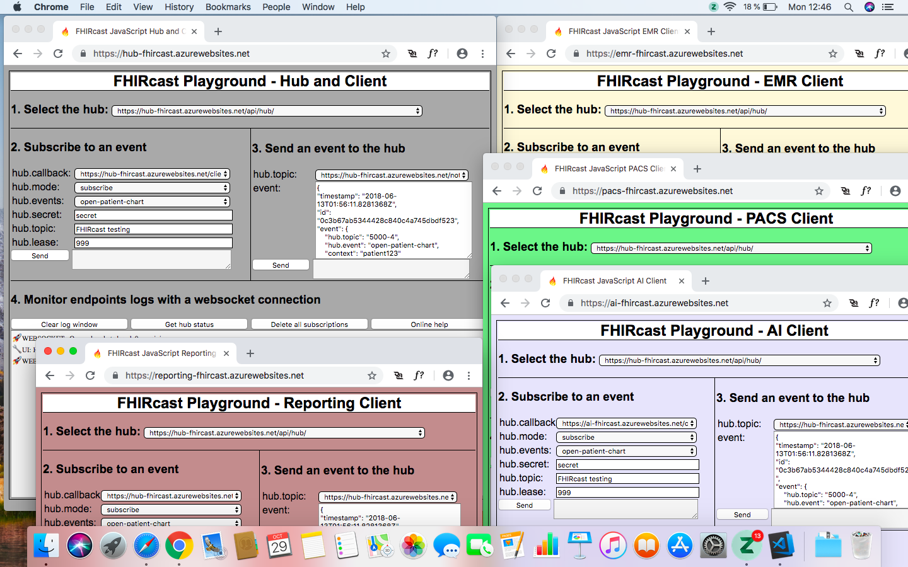
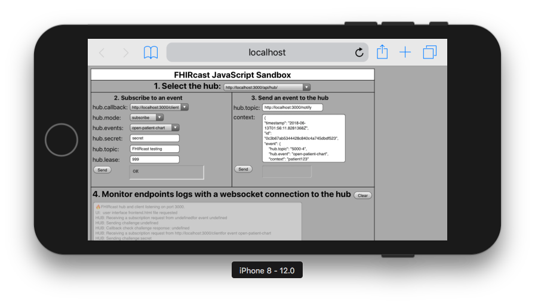

# FHIRcast JavaScript Sandbox
FHIRcast is an HL7 specification designed to provide a lightweight, inexpensive and http-based application context synchronization standard. Find out more at [fhircast.org](https://fhircast.org).

FHIRcast sandboxes provide tools to simulate the workflow of the FHIRcast standard.

This sandbox (sandbox.js) implements the standard using JavaScript and Node.js.

If you are a C#/.net developer, you might prefer to use the [FHIRcast sandbox](https://github.com/fhircast/sandbox).

The following sandbox deployments are available:

* HUB (server and client): https://hub-fhircast.azurewebsites.net/
* EMR client: https://emr-fhircast.azurewebsites.net/
* PACS client: https://pacs-fhircast.azurewebsites.net/
* Reporting client: https://reporting-fhircast.azurewebsites.net/
* AI client: https://ai-fhircast.azurewebsites.net/


The first communication channel defined by FHIRcast is the [W3C WebSub RFC](https://www.w3.org/TR/websub/).  

This model defines a "hub" that receives subscribtion requests from clients (subscribers) for specific events.  Client subscribe to events by sending the hub the location where they want to receive the events (hub.callback). The hub then performs a validation by asking the client about a common secret. In the same message, the hub sends the url where the client can send new events to be published (hub.topic).  If this step succeeds, the hub will start forwarding events to the client.

# Usage
You can start with the [combined hub/client](https://hub-fhircast.azurewebsites.net/) in the cloud.

1. Select the hub that you want to connect to.  Leave the defaults URLs to play around in the standalone hub/client.
2. Select the client endpoint (hub.callback) that will receive the events and then send a subscription request with the send button.  The hub response will be shown in the light gray box next to the button.
3. Send an event to the endpoint specified by the hub in the callback check (hub.topic). The hub response will be shown in the gray box.
4. You can monitor the hub and client endpoints in this text area. The log entries starting with '📡HUB:' and '🖥️CLIENT:' describe backend messages relevant to the standard.  Frontend messages can be seen in the browser console using the browser developer tools. The log entries starting with '🔧UI:' and '🚀WEBSOCKET:' are not relevant to the standard.  They provide information about internal operations.  
  
Next, use the [PACS client](https://pacs-fhircast.azurewebsites.net/)  to subscripe and receive events from the hub.  Check the hub.callback input box value of this client.  How does it differ from the hub?

Finally, add the [EMR](https://emr-fhircast.azurewebsites.net/), [AI](https://ai-fhircast.azurewebsites.net/)  and [reporting](https://reporting-fhircast.azurewebsites.net/) clients to simulate a complete workflow.



# Troubleshooting
* **The log text area does not display any messages:**  Possibly the websocket connection between your browser and the hub is not working.  There could be a proxy server in your route that needs a software update or configuration change to support the websocket 'upgrade' http header.  Another possibility is that you are using more websockets than your deployment allows.  For example, the cheapest azure deployment specifies a maximum of 5 sockets.  In any case, the lack of a websocket does not prevent operation.  You should still see the responses to the messages in the small text areas next to the send buttons.
* **The buttons do not work:** Using the browser developer tool, check in the console why the http messages are not going out.  If you are testing with another instance, you may have to enable 'send data across domains' in your browser security settings. Another possibility is that the receiving endpoint does not have the 'Access-Control-Allow-Origin' header. 
* **The log emojis are black and white:**  On Windows 7, you need Office 2016 to have color emojis.


# Installation
Installing your own sandbox allows you to learn about the inner workings, fix bugs, propose new features or simply provide a private test environment for your project or institution.
Whether deploying locally or in the cloud, environment variables setting may be needed.

## Environment variables
### MODE
The MODE environment variable can be used to specify if the instance is a hub, an EMR client, a PACS client, an AI client or a reporting client.  If this variable is not set, the instance will be a hub.

### PORT
The PORT environment variable can be used to specify the listening port.  If this variable is not set, the port will be 3000.

## Local installation (Windows and  MacOS)
1. Install node at http://nodejs.org.
2. Install npm, the node package manager, at http://npmjs.org.
3. Clone or download the github and run "npm install" in its directory.  This will install the modules defined in package.json.
4. Run with "node endpoint.js".  This starts the endpoints for the hub and the client.
5. Navigate your browser to http://localhost:3000/ to access the UI.


[VScode](https://code.visualstudio.com/) can be used for editing and debugging.

Different port settings are required when running multiple sandboxes locally.
They can be set in launch.json or on the command-line when starting node:
```
MODE=ai PORT=3001 node endpoints.js
```
## Cloud deployment 
### Azure
The Azure VScode extension can be used to deploy the sandboxes as  'App Services'.  Two critical points are the port environment variable defined in endpoint.js and the launch.json file which tells Azure which program to run. They should not need any modifications.  

You can add environment variables for the instance by creating 'Application Settings' as shown in the following picture.


 

### Amazon
In AWS, you can use the 'ElasticBeanStalk' deployment to create a WebApp.  

## Mobile deploymnet (iOS, Android)
Thanks to https://github.com/janeasystems, running Node.js applications and therefore the FHIRcast sandbox. 


# Program Description

There are seven files:  endpoints.js, hub.html,ai.html,emr.html.pacs.html,reporting.html and package.json.

* The endpoints.js file provides all listening (client and hub) endpoints using Node.js with the express module.  

* There is one HTML file for each client UI.  They trigger the client subscription requests and performs client event notifications to the hub.

* The package.json file specifies the Node.js modules used in the app.
  

## Endpoints description
### Server (hub) endpoints
These two endpoints are not active when the MODE environment variable is set to 'emr','pacs','reporting' or 'ai'.
* "/api/hub": POST with form query string to receive subscription requests from the clients
 
* "/notify": POST with JSON payload to receive events from the clients 

### Client endpoints

* "/client": POST with JSON payload to receive events and subscribtion cancelations from the hub.

* "/client": GET with standard query string to receive callback check from the hub. 

### Utility endpoints (not in the standard)

* "/": GET with HTML/JavaScript to provide the web page to subscribe and post events to the hub.  Default is to return the hub.html file.  If the MODE environment variable is set to 'emr','pacs','reporting' or 'ai'; the file emr.html, pacs.html,reporting.html or ai.html will be returned.

* "/log": (on ws not http), Websocket to broadcast the endpoints logs to the browser.

The following two endpoints are not active when the MODE environment variable is set to 'emr','pacs','reporting' or 'ai'.

* "/status":  POST without content will trigger a hub status message to be broadcasted to the connected websockets.

* "/delete":  POST without content will delete all subscriptions.


## Front-end description

### HTML
The four sections of the web page are each contained in their own division or 'div':  selectHub, subscribe, notify and monitor. Simple styling is embedded to avoid an extra file to maintain.

### JavaScript
The two FHIRcast-relevant functions are **sendEvent()** and **sendSubscription()**.  Both are using 'XMLHttpRequest' instead of the newer 'fetch' function in order to support Internet Explorer.
* sendSubscription():  This function builds a query string using the data from the input fields of section 2 and POSTs it to the hub with 'Content-type' header set to 'application/x-www-form-urlencoded'.
* sendEvent():  This function builds a JSON string using the data from the input fields of section 3 and POSTs it to the hub with 'Content-type' header set to 'application/json'.


Other functions are specific to the sandbox:
* setURLs(): On page load, this function attemps to preselect the correct endpoints from the three drop-down menus.  
* getHubStatus(): Makes a POST to the hub to trigger the display of active subscriptions when the button is clicked.
* deleteSubscriptions(): Makes a POST to the hub to clear the subscriptions list when the button is clicked.