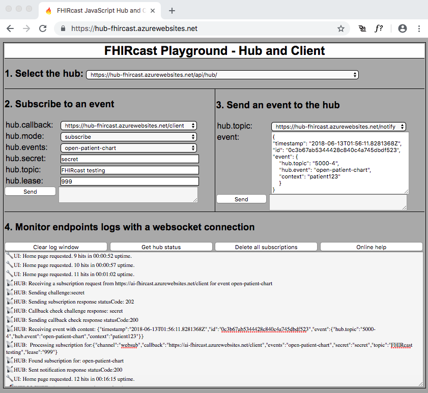

# FHIRcastJS
JavaScript/Node Sandbox for FHIRcast

This is a minimalistic WIP implementation of the FHIRcast proposal put together for hands on training sessions.

FHIRcast is a new draft standard to facilitate front-end integration between vendors.  Find out more at fhircast.org. [http://fhircast.org].

# Description

There are three files:  index.js, frontend.html and package.json.

The index.js file provides all listening (client and hub) endpoints using node with the express module.  

The frontend.html file is the client UI that triggers the client subscription requests and performs client event notifications to the hub.

You can use the sandbox as a client or a hub or both.

## Endpoints description
### Server (hub) endpoints

"/api/hub": POST with form query string to receive subscription requests from the clients
 
 
 "/notify": POST with JSON payload to receive events from the clients 

"/": GET with HTML/JavaScript (frontend.html file) to provide the web page to subscribe and post events to the hub.

"/log": (on ws not http), Websocket to broadcast the server side logs to the client browser.

### Client endpoints

"/client": POST with JSON payload to receive events and subscribtion cancelations from the hub.

"/client": GET with standard query string to receive callback check from the hub 

Installation
========================================
On Windows or MacOS:
1. Install node at nodejs.org
2. Install npm, the node package manager, at npmjs.org.
3. Clone or download the github and run "npm install" in its directory.  This will install the modules defined in package.json.
4. Run with "node index.js".  This starts the endpoints for the hub and the client.
5. Navigate your browser to "http://localhost:3000/" to access the UI.

VScode [https://code.visualstudio.com/] can be on MacOS and Windows for editing and debugging.

